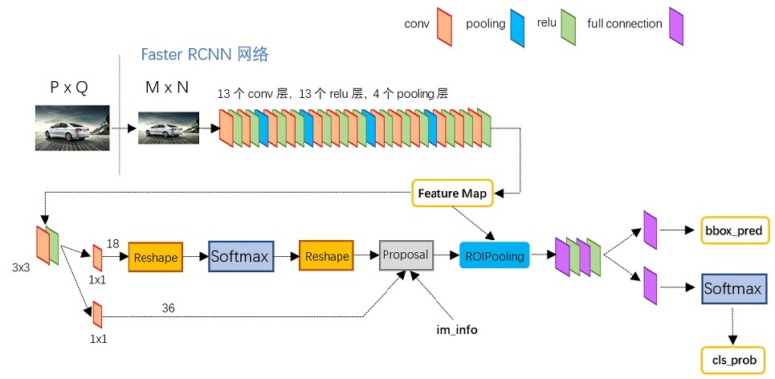
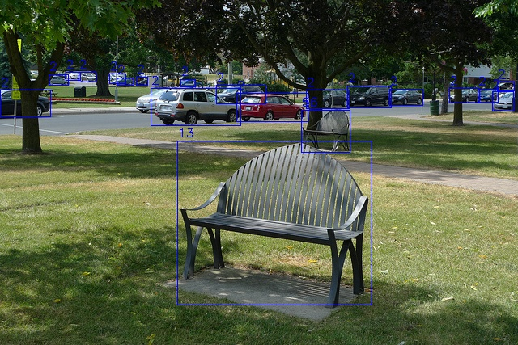

# Faster R-CNN ONNX Export and Inference

## Overview

This repository provides the code for exporting Faster R-CNN models to ONNX format, along with corresponding inference scripts. The goal is to establish a reproducible pipeline integrating MMDetection training, ONNX export, and inference, while ensuring code reusability and strict version control for reproducibility.

The motivation for creating this repository stems from the following common issues observed in mainstream open-source projects:

1. Inference code is often tightly coupled with the PyTorch training framework, making the overall structure complex and hindering a clear understanding of the algorithm’s execution process;

2. Some projects only provide inference implementations in C++, which raises the barrier for users who wish to quickly learn or validate algorithmic principles;

3. Repositories like MMDetection employ custom operators when exporting two-stage models, adding further complexity to model export and deployment, which is unfavorable for rapid prototyping.



## environment

This environment is primarily configured to support model export using [mmdet](https://github.com/open-mmlab/mmdetection/tree/v2.28.2). Python 3.8 is selected because MMDet relies on custom operators implemented in MMCV. Higher Python versions do not have precompiled MMCV wheels available, requiring manual compilation, which is more cumbersome. Therefore, Python 3.8 is used as a more stable and convenient option.

```bash
# Python 3.8 environment
# The following commands must be executed in order; key packages require strict version locking
pip install -r requirement.txt

mim install mmcv-full==1.7.2

pip install mmdet==2.28.2
git clone https://github.com/open-mmlab/mmdetection.git --branch v2.28.2 --depth 1

```

If you want to bypass the export step, you can directly download the corresponding models from the [release](https://github.com/pleb631/fasterrcnn-onnx/releases/tag/v0.0.1). In this case, only basic packages such as `onnxruntime`, `opencv`, and `numpy` are required.

## 模型导出

First, download the required weight file. MMDetection provides the corresponding [weights](https://download.openmmlab.com/mmdetection/v2.0/faster_rcnn/faster_rcnn_r50_fpn_1x_coco/faster_rcnn_r50_fpn_1x_coco_20200130-047c8118.pth), and place it in the `ckpt` directory.  
Then, run the code.

```python
python export.py
```

The code will export the `backbone + RPN` as `model1.onnx`, and the `ROIHead` as `model2.onnx`.

### `model1.onnx`

The input is an image with shape `[1, 3, H, W]`.

There are a total of 15 outputs:

1. Outputs 0–4 are the classification scores for each feature level, with shape `[1, 3, H/s, W/s]`, where `s` is the stride of the corresponding feature level, and `3` corresponds to the number of anchor types per location;

2. Outputs 5–9 are the bounding box regressions for each feature level, with shape `[1, 12, H/s, W/s]`, where `12` represents the 4 regression values (x, y, w, h) for each of the 3 anchors;

3. Outputs 10–14 are the feature maps from each level, with shape `[1, 256, H/s, W/s]`. The number `256` indicates that all feature maps are projected to 256 channels, which are used later for ROIAlign.

### `model2.onnx`

The input consists of region features after ROIAlign, with shape `[B, 256, 7, 7]`, where `B` is the number of proposals selected from the first stage.

There are two outputs:

1. The first output contains the classification scores for each proposal, with shape `[B, 81]`, where 80 classes represent foreground categories, and the 81st class represents the background;

2. The second output contains the bounding box regressions for each proposal, with shape `[B, 320]`. The value `320` corresponds to regression outputs for all 80 foreground classes (i.e., 4 values × 80 classes). Unlike YOLO, which regresses a single set of box coordinates, Faster R-CNN regresses one set of coordinates for each class.

### Output Verification

After model export, the outputs of the PyTorch version and the ONNX version will be automatically compared. If the difference between the corresponding outputs is less than `1e-4`, a total of 17 `True` values will be printed.  
If any `False` appears, it is considered a significant accuracy loss and the export is deemed a failure.

## Model Inference

Ensure that the `ckpt` folder contains the exported ONNX files and that output verification has passed.  
Then, run:

```python
python demo.py
```


